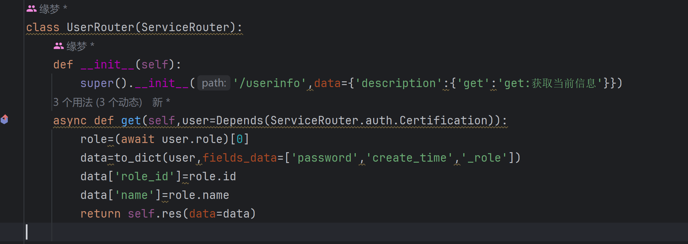

# FastAPI Project Template

## 项目信息
- **version：** 1.31
- **name:** FastAPI Project Template

## 项目简介

本项目是一个基于 FastAPI 构建的项目模板，旨在帮助开发者快速启动并构建高效的 Web 应用程序。通过这个模板，您可以轻松实现以下功能：

- **Redis 和 MySQL 快速集成**：内置对 Redis 和 MySQL 数据库的支持，只需简单配置即可连接并使用。
- **自动注册路由**：通过遍历指定目录，自动注册 FastAPI 路由，简化了开发过程。
- **响应数据压缩**：内置 Gzip 中间件，自动压缩响应数据，减少网络传输量，提高响应速度。
- **浏览器缓存支持**：自动添加浏览器缓存控制头部，提升页面加载速度，减少服务器负载。

## 功能特性

### 1. Redis 和 MySQL 快速构建
- **Redis 集成**：通过配置文件，快速连接 Redis，适用于缓存和会话管理等场景（redis-py）。
- **MySQL 集成**：只需在配置文件中填写数据库连接信息，即可快速与 MySQL 数据库进行交互（tortoise-orm）。
- **数据库迁移**：使用 aerich 进行快速的迁移。

### 2. 自动注册路由 & 请求日志自动记录
- **路径自动注册**：项目自动遍历指定目录，并将其中符合条件的 Python 文件自动注册为 FastAPI 路由，无需手动引入(依赖于auto_register_routes方法，需要传入目录路径，其次是接口前缀)。
- **灵活的路由路径配置**：支持目录嵌套结构的路由自动注册，确保项目结构清晰且易于维护。
- **日志功能**：支持自动记录请求信息，用来排除恶意流量。
- **用法讲解**:1.使用fastapi原生apirouter对象，直接赋值为router即可 2，使用封装的ServiceRouter类自动注册，无需实列


### 3. 数据压缩 & 常规的错误视图处理
- **错误状态码自动处理**：只需要在配置文件设置常用状态码和跳转的 URL 即可实现。
- **内置 Gzip 支持**：使用 FastAPI 的 Gzip 中间件自动压缩响应数据，适用于大型响应内容的场景。
- **自定义压缩阈值**：可以通过配置设置压缩的最小数据大小，实现精细化控制。

### 4. 浏览器缓存
- **自动缓存控制**：在响应头中自动添加 `Cache-Control`，`ETag` 等缓存控制头部，支持自定义缓存时间。
- **减少服务器负载**：通过缓存机制有效减少重复请求，提高应用的响应性能。

### 5. 工具类封装
- **OAuth2 认证封装**：提供 JWT 生成，身份鉴权的封装。
- **常见加密算法封装**：提供 Base64、Hex、MD5、SHA256、RC4 等常用加密和解密操作的封装。

### 6. ServiceRouter
- **ServiceRouter 封装**：封装了各种工具和响应模型方法，包括 JWT 生成和身份认证（auth），旨在通过面向对象的方式进行高质量的代码开发。此封装帮助开发者快速实现常用的 HTTP 请求方法，并简化业务逻辑处理。

### 7. RESTful API 模型化开发
- **封装 ServiceRouter 方法**：提供 HTTP 常用请求方法：get、post、put、delete，封装响应方法快速处理业务需求。
- **路由注册支持**：凡是在 controller 里面使用了 ServiceRouter，无需实例化对象，自动注册。

### 8. 接口权限认证
- **权限实现**：我们封装了基础的权限规则，并提供基础的登录注册接口进行权限认证。首先定义了 open、add、delete、get、put、all 六种规则，通过 description 属性定义规则。
  - **open**：申明之后该接口会为所有登录的用户进行放行。
  - **add、delete、put、get**：在设计接口时，这四个规则应该按照 RESTful API 进行设计，get 进行读取，delete 进行删除，put 进行更新，add 进行新增。当 description 申明了其中一个会在 permission 表里面进行读取，查看该用户是否有相应的规则。
  - **all**：all 规则和 open 一样比较特殊，all 仅单方面用于数据库的存储。一旦在 permission 表里面申明了某个接口路径的 all，该路径将不受到 add、delete、get、put，在接口处申明 all 等于无效。
- **权限错误**,当出现权限错误时会引发403错误 err提示权限错误
### 9.响应规范
- **响应模型** 响应方法位于/core/res.py 所有的错误以及正常响应都应使用此方法进行返回 状态码不为200 不应该直接使用message而是err ，如果使用的ServiceRouter 进行开发 直接使用类中的res方法和/core/res的响应方法为一个
## 规则讲解

如下图我们对 UserRouter 类 userinfo 路径进行了规则申明为 get。首先会从 permission 表进行读取，首先读取该用户是否具有该接口的 all，如果有则直接放行，没有则继续读取是否有 get。



## 更新说明
### 1. 我们将在后续的版本围绕 ServiceRouter 对象进行大力整合。目前已经将基础的身份认证，路由实现进行整合。
### 2. 后续版本将逐步实现带接口认证的，会提供一个基础的登录注册功能以及接口认证。

## 快速开始

### 1. 克隆项目

```bash
git https://github.com/zy2006cs/fastapi-project-template.git
cd fastapi-project-templates
```
### 2.环境配置
```bash
pip install -r requirements.txt
python app.py
```